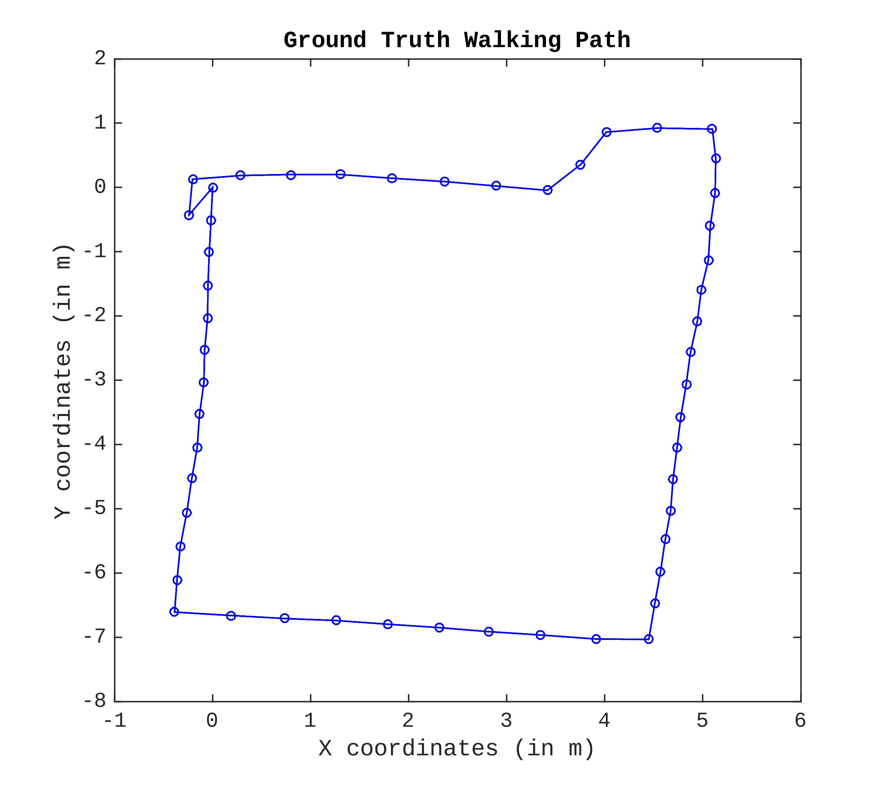
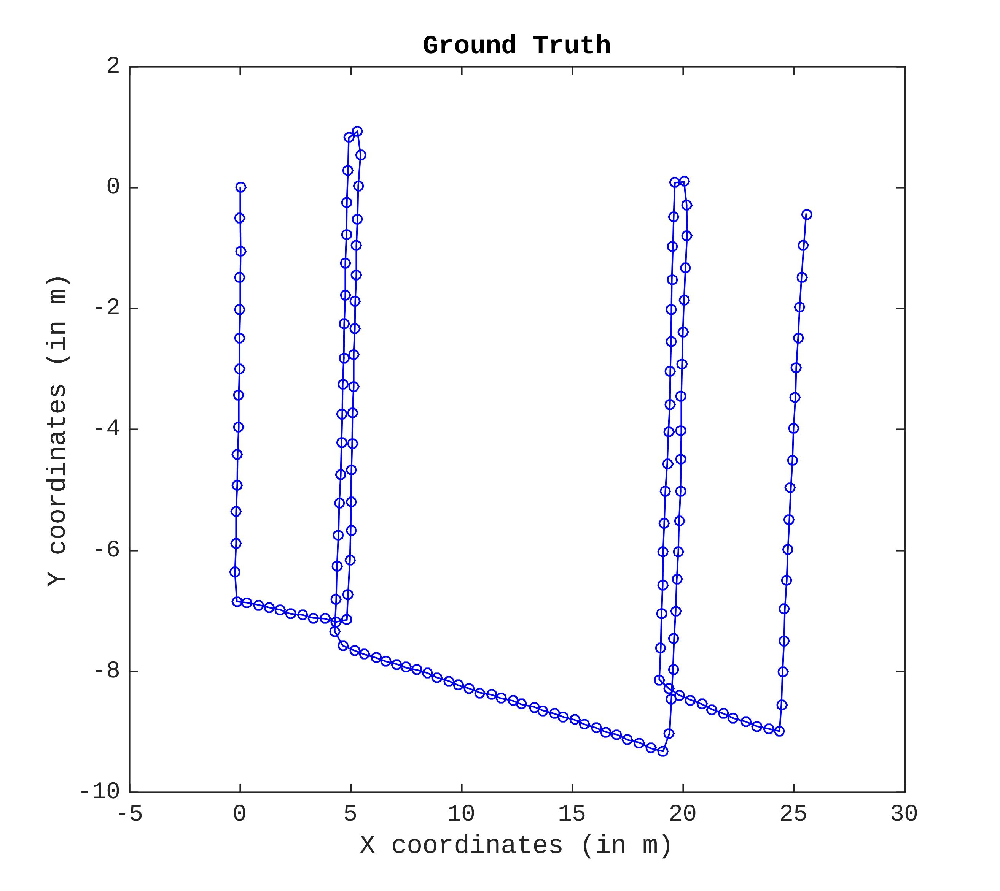
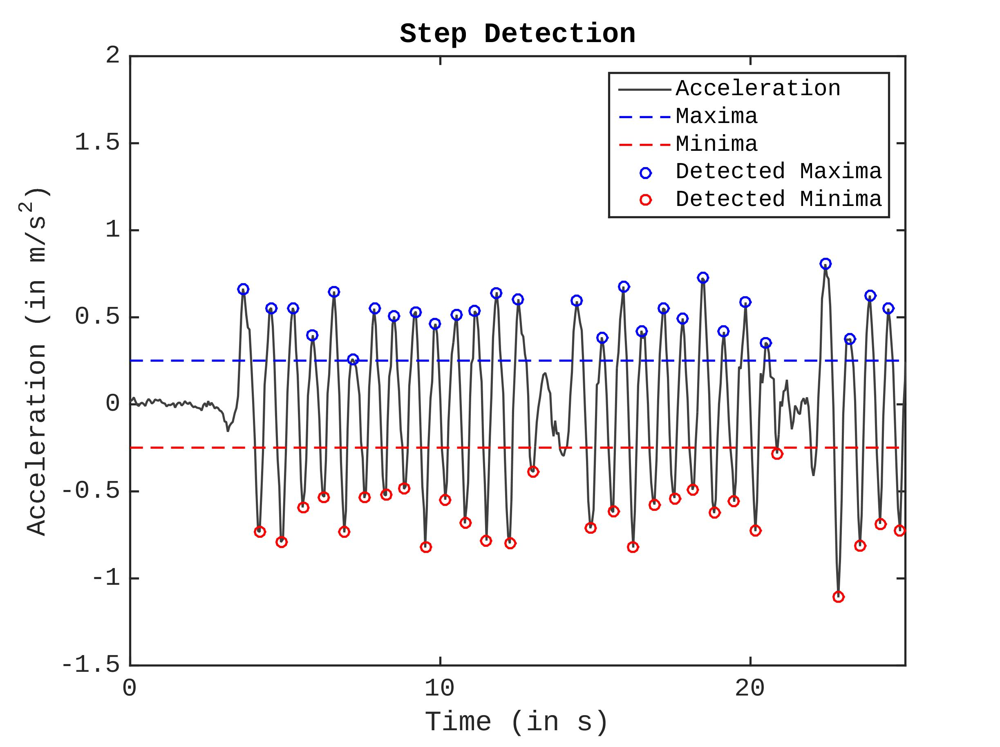
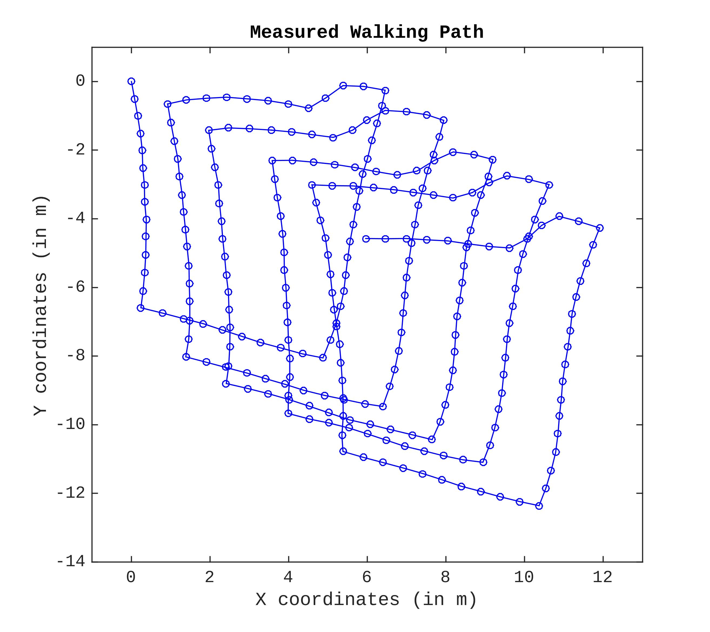
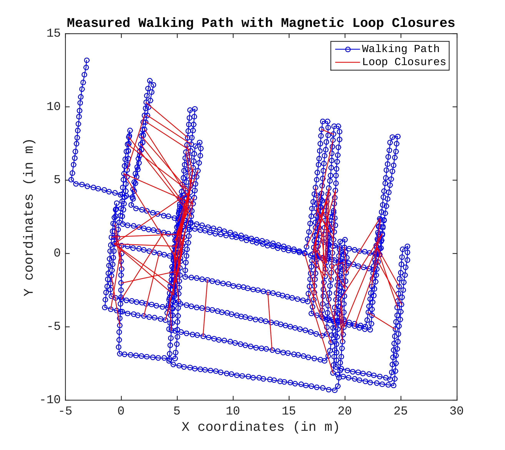
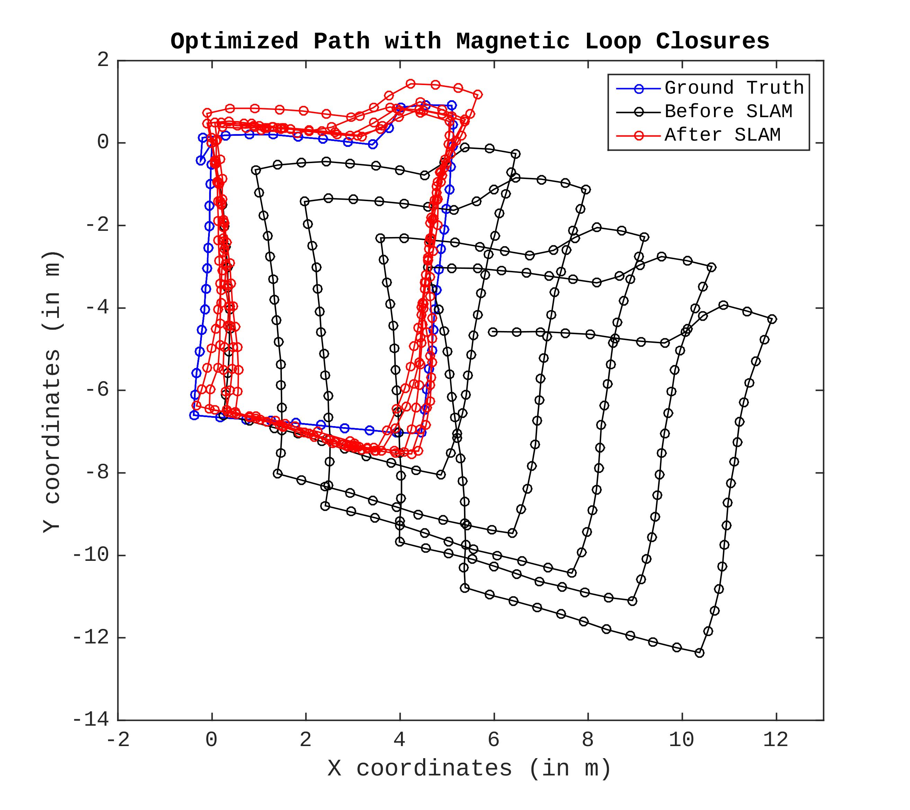

# A Graph-SLAM Implementation with a Smartphone

This repo contains the matlab source codes of the Robust Graph-SLAM implementation. There are many robust method but this one is inspired by  a method called [Switchable Constraints](https://www.tu-chemnitz.de/etit/proaut/publications/IROS12-switchableConstraints.pdf) developed by Sünderhauf, N.

For further details of the application, I refer readers to the [report](report/A-Graph-SLAM-For-a-Smartphone.pdf).

## Abstract

The indoor positioning application
  with smartphones is a challenging problem
  because an average commercial smartphone has 
  no specialized hardware solution yet. 
  Therefore, one has to exploit the
  existing technologies; such as inertial sensors, signal strength
  measurements or camera. Since many of these technologies are not
  designed for the positioning purposes, hybrid systems are needed to
  compensate each other's drawback. One of the straightforward method
  is to build a radio map, composed of 
  RSSI
  that can be acquired from Wi-Fi or ble, 
  where you
  create grid-based maps with the unique fingerprints. Downside of
  the fingerprinting is that it requires system owners to build the 
  radio map. The easiest way to build this map is to store
  the signal strength measurements by standing at the reference
  positions.
  However, this solution does not scale to the big buildings.  
  To make
  this radio mapping process efficient, 
  we proposed Graph-based SLAM 
  approach in this research paper. 
  With RSSI, one can collect the measurement during walking.
  On the contrary, the problem gets more complicated as we have to 
  track the user's walking path while mapping. 
  To tackle this problem, we first lay out
  the general SLAM problem, which is well-known in robotics domain.
  Then, we transform the problem formulation to smartphone
  application since we don't have such rich sensing capabilities like
  robots in smartphones. By using this transformed SLAM algorithm, we
  compare Wi-Fi, BLE, and Magnetic Field sensors in the context
  of loop closure. As a consequence of this comparison, we find out
  that the
  Magnetic Field sensor is a valid candidate for place recognition 
  by using the proposed simple dissimilarity function. 
  Finally, we present the recovered walking path results.
  

## Ground Truth Trajectories

### Short Walking Path

### Long Walking Path

## Pedestrian-Dead Reckoning (PDR)

This algorithm detects the steps using accelerometer in the phone.

## Measured Walking Path with PDR

Drifted measured walking path results.

### Short Walking Path

### Long Walking Path

## SLAM Optimization Results with Magnetic Field Loop Closures

### Short Walking Path

### Long Walking Path

